# MERISKILLS-SALES-DATA-ANALYSIS
## TABLE OF CONTENT
- [OBJECTIVE](#OBJECTIVE)
- [ABOUT THE DATA](#ABOUT_THE_DATA)
- [BUSINESS TASK](#BUSINESS_TASK)
- [DATA TRANSFORMATION AND DATA CLEANING](#[DATA_TRANSFORMATION_AND_DATA_CLEANING])
- [DATA ANALYSIS AND VISUALIZATION](#DATA_ANALYSIS_AND_VISUALIZATION)
- [RECOMMENDATION AND CONCLUSION](#RECOMMENDATION_AND_CONCLUSION)

## OBJECTIVE
The aim of this project is to analyse the sales data, extract valuable insights and identify trends, top-selling products, and revenue metrics in order to improve business decisions and increase revenue. It showcases my ability to manipulate and derive insights from large datasets, enabling me to make data-driven recommendations for optimizing sales strategies.
## ABOUT THE DATA
The source of the data is from *Kaggle*. The dataset came in as a text file,uploaded it using the 'Get Data' option in Power BI, and then proceeded to transform the data. To extract valuable insights, I will be looking at the sales trends over time, identify the best-selling products, calculate revenue metrics such as Total Sales, Profit and Profit margins, and create visualizations to present my findings effectively.
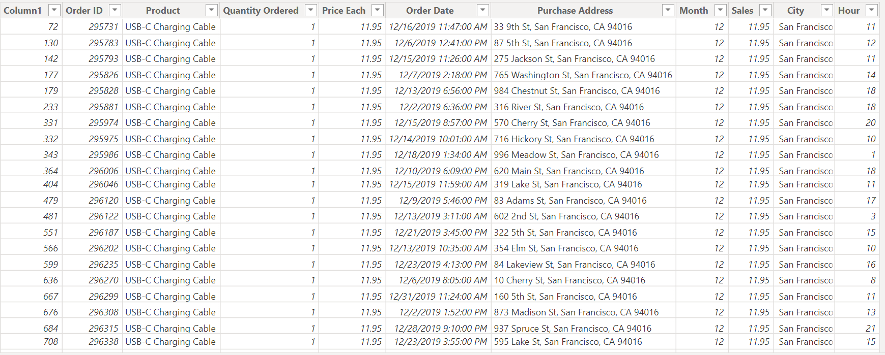
## BUSINESS TASK
- What is the overall sales trend?
- What are the products performance by sales?
- What are the product performance by quantity?
- What are sales performance by city?
## DATA TRANSFORMATION/DATA CLEANING
The data is transformed and cleaned with the help of Power Query and this are some of the processes;
- Data type of each column checked and converted appropriately
- Split the datetime into date and time respectively using Split Column By Delimiter
- Rename columns
- Remove redundant columns

Data Analysis Expression (DAX): I created two new columns (Profit & Profit margin) using calculated column. Also, DAX measures was implemented to calculate essential metric, Total Sales.

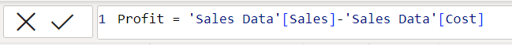
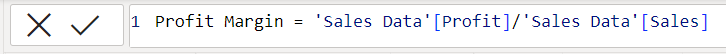
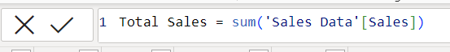
## DATA ANALYSIS AND VISUALIZATION
### Key Performance Indicators
- NUMBER OF PRODUCTS -19
- TOTAL PRODUCTS SOLD -186K
- TOTAL QUANTITIES SOLD-209K
- TOTAL SALES -$34.5M
### Overall Sales Trend
December is the most productive month with a total sales of $4,613,443.34, while January has the lowest sales performance of $1,813,586.44. This further explains that sales are low at the beginning of the year then it becomes high at the end of the year
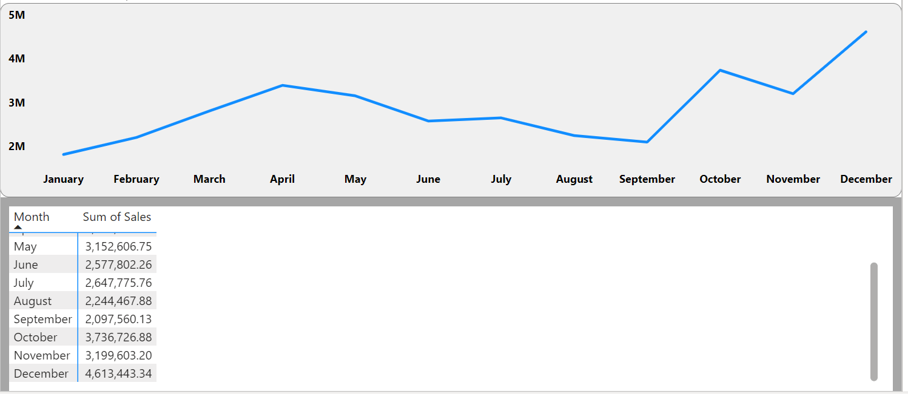
### Product Performance By Sales: 
In the year 2019, Macbook Pro Laptop generated a high sales of $8.05M, followed by iPhone while ThinkPad Laptop has a high sales of $1,999.98 approximately $2,000 in the year 2020, followed by Macbook Pro Laptop. So, the best three products in terms of sales are Macbook Pro Laptop, iPhone and ThinkPad Laptop.
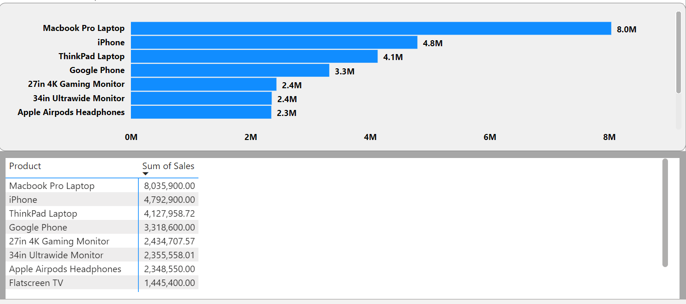**_Top10 2019_**
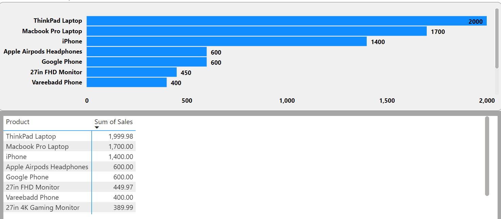**_Top10 2020_**
### Product Performance By Quantity: 
AAA Batteries (4-packs) is the most bought product, it sold about 31k quantities, while LG Dryer sold the least of 646 quantities.
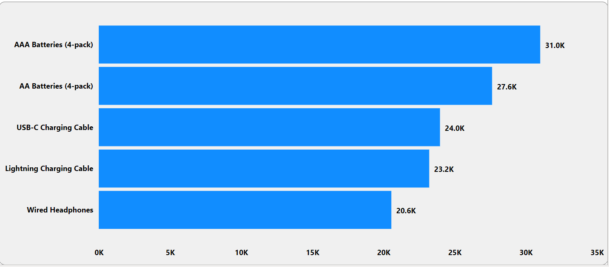
### Sales Performance By City:
San Francisco is the top city with the highest sales performance in both year 2019 and 2020, while the city with the least sales in the year 2019 is Austin and Seattle in the year 2020. This invariably implies that San Francisco has the highest quantity ordered.
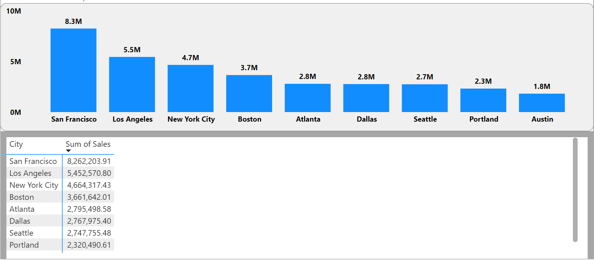
## RECOMMENDATION AND CONCLUSION
There are lots of insights to derive from this dataset. These are just a few of the analysis derived.
- The company needs to create a good marketing plan, it needs to focus on the cities (e.g. Austin, Seattle) with low sales, likewise the products with low sales.
- Pop-up sales can be offered to boost sales, especially during the beginning of the year, which is January.
- There should be adequate stock of products with high sales and high demand.
- The reason for low sales can be as a result of customer dissatisfaction. The company should then get to know their customers by getting feedbacks from them, which give insight into their needs and meet their expectations.
  
Below is the dashboard for review;
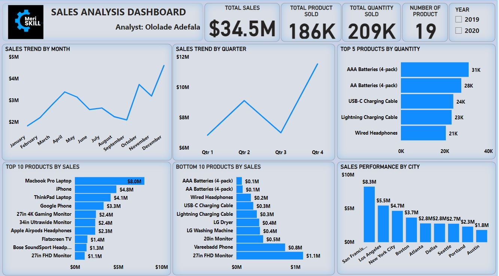
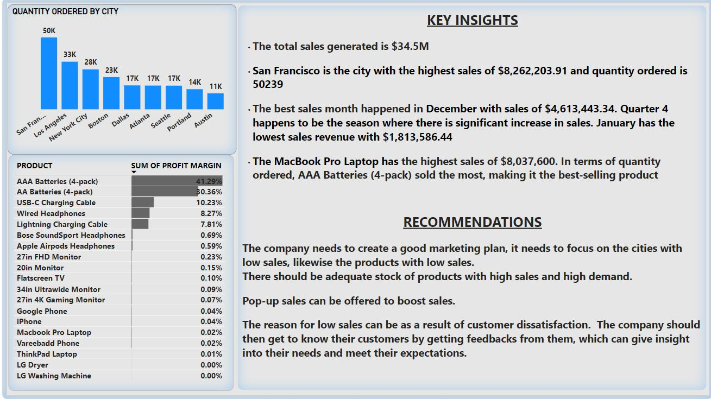
Explore the full project insights [here](https://tinyurl.com/MeriSkillsSalesAnalysis)
